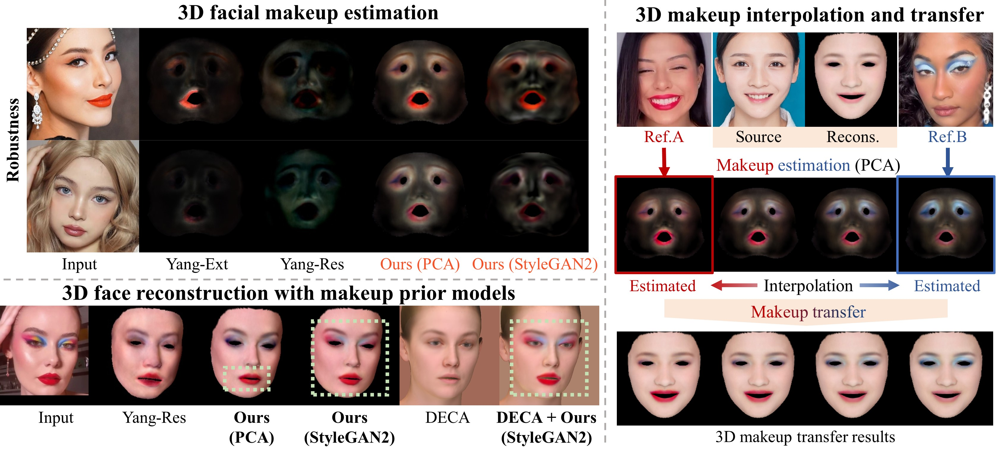

# Makeup Prior Models for 3D Facial Makeup Estimation and Applications (CVPR2024)
<a href='https://arxiv.org/abs/2403.17761'></a> &nbsp; 
<a href='https://yangxingchao.github.io/makeup-priors-page/'></a> &nbsp; 

The PyTorch code for the following paper:
> [**Makeup Prior Models for 3D Facial Makeup Estimation and Applications**](https://yangxingchao.github.io/makeup-priors-page),  
> Xingchao Yang, Takafumi Taketomi, Yuki Endo, Yoshihiro Kanamori,   
> *CVPR 2024*

This project is based on and extends the following projects and uses some of the dataset, code and models from them:
> [**Makeup Extraction of 3D Representation via Illumination-Aware Image Decomposition**](https://yangxingchao.github.io/makeup-extract-page),  
> Xingchao Yang, Takafumi Taketomi, Yoshihiro Kanamori,   
> *Computer Graphics Forum (Proc. of Eurographics 2023)*
> 
> The [makeup-extract-dataset](https://drive.google.com/file/d/1KC1eUU8HLD7y_DdomSzGKJWR2Hmapzr4/view?usp=drive_link) is used to build the makeup prior models. 

## Prerequisites
1. Python3
2. PyTorch with CUDA
4. Nvdiffrast

## Installation
Run the following commands for installing other packages:
```
pip install -r requirements.txt
```

## Inference
### Prepare prerequisite models
Download 3DMM model from [FLAME](https://flame.is.tue.mpg.de/) and put them into ```resources``` folder

We need the following models for our project:
```
albedoModel2020_FLAME_albedoPart.npz
FLAME_masks.pkl
FLAME_texture.npz
generic_model.pkl (from FLAME2020)
```

### Makeup Priors and Pretrained Models
Put the [makeup priors and trained models](https://drive.google.com/drive/folders/1Pe2M3TYmFJ0CGEq_QFUgNvqs_1OtQ5QY?usp=sharing) to ```root dir```.
These files contain makeup prior models (PCA and StyleGAN2), and associated inference weights for their coefficients.
```
\resources\priors
\checkpoints
```

### Demo  
Perform a sequence of processes on ```img_0.jpg```, ```img_1.jpg```, and ```img_non.jpg``` in the ```sample``` folder.
We will show a series of makeup estimation, reconstruction, interpolation and transfer demos.
The results of the execution can be found in the ```results``` folder

**Preprocess** 
   Detect the landmark, and crop the image so that it aligns with the face. Then obtain an image of the skin area:
```
python preprocess.py -i './sample/img_0.png' -o './results/align' -n 'aligned_img_0.png' -m 'aligned_mask_0.png'
python preprocess.py -i './sample/img_1.png' -o './results/align' -n 'aligned_img_1.png' -m 'aligned_mask_1.png'
python preprocess.py -i './sample/img_non.png' -o './results/align' -n 'aligned_img_non.png' -m 'aligned_mask_non.png'
```

**PCA Prior Model based Makeup Estimation**
```
python pca_estimate.py -i './results/align/aligned_img_0.png' -o './results/pca_reconstruction/0'
python pca_estimate.py -i './results/align/aligned_img_1.png' -o './results/pca_reconstruction/1'
```

**StyleGAN2 Prior Model based Makeup Estimation**
```
python style_estimate.py -i './results/align/aligned_img_0.png' -m './results/align/aligned_mask_0.png' -o './results/style_reconstruction/0'
python style_estimate.py -i './results/align/aligned_img_1.png' -m './results/align/aligned_mask_1.png' -o './results/style_reconstruction/1'
```

**PCA based Makeup Interpolation and transfer**
```
python pca_interpolate_transfer.py
```

**StyleGAN2 based Makeup Interpolation and transfer**
```
python style_interpolate_transfer.py
```


# Citation
If you find our work useful for your research, please consider citing our papers:
```bibtex
@inproceedings{yang2024makeuppriors,
          author = {Yang, Xingchao and Taketomi, Takafumi and endo, yuki and Kanamori, Yoshihiro},
          title={Makeup Prior Models for {3D} Facial Makeup Estimation and Applications},
          booktitle={Proceedings of the IEEE/CVF Conference on Computer Vision and Pattern Recognition (CVPR)},
          year={2024}
        }
```
```bibtex
@article{makeup-extraction,
          author = {Yang, Xingchao and Taketomi, Takafumi and Kanamori, Yoshihiro},
          title = {Makeup Extraction of 3D Representation via Illumination-Aware Image Decomposition},
          journal = {Computer Graphics Forum},
          volume = {42},
          number = {2},
          pages = {293-307},
          year = {2023}
      }
```

### Acknowledgements
Here are some of the resources we benefit from:
* [makeup-extract](https://github.com/YangXingchao/makeup-extract)
* [Deep3DFaceRecon_pytorch](https://github.com/sicxu/Deep3DFaceRecon_pytorch)
* [pytorch_face_landmark](https://github.com/cunjian/pytorch_face_landmark)
* [face-parsing.PyTorch](https://github.com/zllrunning/face-parsing.PyTorch)
* [DECA](https://github.com/yfeng95/DECA)

